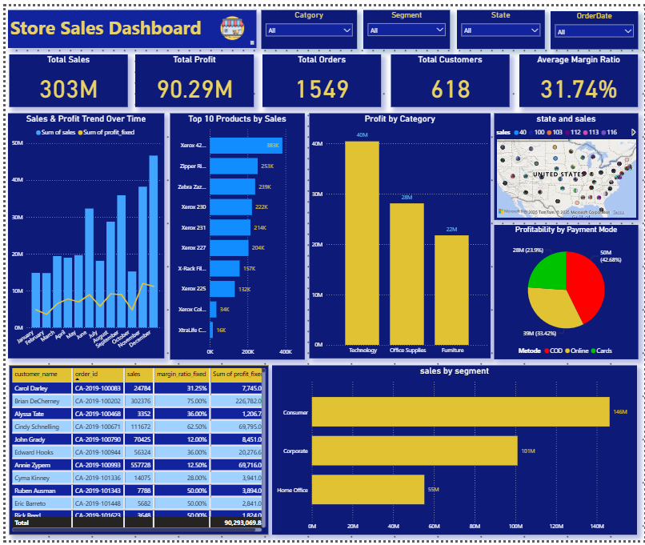

# SuperStore Sales Dashboard - Power BI  
 
Proyek ini merupakan implementasi **dashboard interaktif** menggunakan **Microsoft Power BI** untuk menganalisis penjualan pada dataset *SuperStore*. Dashboard ini dirancang untuk memberikan wawasan bisnis secara cepat dan visual, sehingga membantu pengambilan keputusan berbasis data.  

---

## 📊 Fitur Dashboard  
1. KPI Utama 
   - Total Sales  
   - Total Profit  
   - Total Orders  
   - Total Customers  
   - Average Margin Ratio  

2. Visualisasi Data
   - Sales & Profit Trend Over Time 
   - Top 10 Products by Sales 
   - Profit by Category
   - Sales by Segment 
   - Profitability by Payment Mode 
   - State and Sales Map 
   - Customer Detail Table


## 🗂 Struktur Repository  
```

├── Dashboar_SuperStore_Sales_PowerBI.png   # Screenshot dashboard
├── SuperStore_Sales_Dashboard.pbix         # File Power BI Dashboard
├── data_fixed.xlsx                         # Dataset SuperStore (fixed version)
└── README.md                               # Dokumentasi project

````

## 📷 Tampilan Dashboard



---

## 📌 Tools & Teknologi

*  
*  

---

## ✨ Insight Utama

* **Technology** adalah kategori dengan profit terbesar (~40M).
* Segment **Consumer** memberikan kontribusi sales tertinggi (~146M).
* Rata-rata margin ratio mencapai **31.74%**.
* Top produk seperti **Xerox 42L** menghasilkan penjualan tertinggi (~383K).

---

## Kolom utama yang dipakai:
order_id, order_date, ship_date, ship_mode, customer_name, segment, country, city, state, region, category, sub-category, product_name, sales, quantity, profit (original), profit_fixed, margin_ratio_fixed, payment_mode

---

## Langkah cleaning / normalisasi yang dilakukan (ringkasan):
* Hitung margin_ratio = profit / sales.
* Hapus baris dengan sales <= 0 atau margin ekstrim.
* Perbaiki baris dimana margin > 80% → profit_fixed = sales * median_margin (atau target margin lain) untuk menghilangkan outlier input.
* Simpan profit asli untuk referensi; gunakan profit_fixed dan margin_ratio_fixed untuk analisis/visualisasi.

## 🧑‍💻 Author

Created by **Adi Dwi RiBowo**

```

